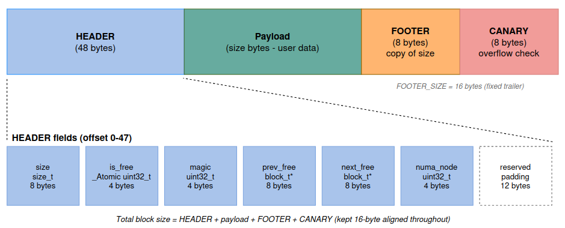
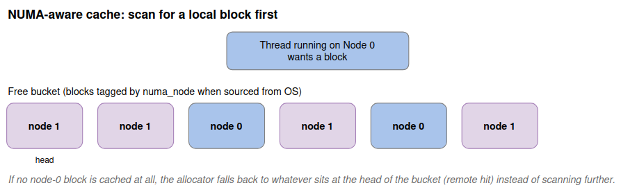

### Architecture Overview
- **Memory sourcing**: acquires raw memory from the OS via `sbrk()` for small requests (< 128KB) and `mmap()` for large ones, tracked through a region registry so the allocator always knows which address ranges it owns.
- **Block management**: every allocation is wrapped in a fixed-size header plus a footer/canary pair, giving the allocator O(1) neighbor lookups for coalescing and a lightweight corruption check on every free.
- **Free-list allocation**: free blocks live in a doubly-linked list searched by one of three pluggable strategies (First-Fit, Best-Fit, Worst-Fit); Best-Fit is the default.
- **Coalescing**: adjacent free blocks are merged immediately on `free()` to keep external fragmentation low.
- **Integrity checking**: magic numbers, boundary-tag self-checks, and a redzone canary catch heap corruption and buffer overflows early; a full heap walk (`heap_check_consistency()`) can independently verify every block against the free list.
- **Thread safety**: a global mutex protects the shared free list; a per-thread cache layer removes that mutex from the hot path for common allocation sizes.
- **NUMA awareness**: every block records the NUMA node its memory was sourced from; the thread-local cache hands back a block from the caller's current node when one is available, and falls back to any node otherwise.

### Memory Block Layout

  

&emsp;Every block is a contiguous run of four regions: a 48-byte HEADER holding the block's metadata, the payload the caller actually reads and writes, an 8-byte FOOTER that duplicates the block's size (used to walk backward to the previous block during coalescing), and an 8-byte CANARY that detects writes past the end of the payload. The footer + canary together form a fixed 16-byte trailer (FOOTER_SIZE).    

&emsp;The `mem_alloc()` return value points at the start of the payload, not the header — the header sits invisibly *before* the pointer the caller holds. Internally, the 48-byte header breaks down into: `size` (8 bytes), `is_free` (4 bytes, `_Atomic` — carries a third `BLOCK_FREE_THREAD_LOCAL` state, see [Multithreading](#multithreading)), `magic` (4 bytes, corruption sentinel), the `prev_free`/`next_free` pointers (8 bytes each) used only while the block sits in a free list, `numa_node` (4 bytes, the NUMA node this block's memory came from), and 12 bytes of reserved padding that keeps the header a 16-byte multiple. The whole block is kept 16-byte aligned end-to-end so every payload address satisfies common alignment requirements without extra work.

### Multithreading

  

Each thread owns a private cache covering a handful of common size classes. `mem_alloc()`/`mem_free()` pop and push blocks from this cache directly, bypassing `heap_mutex` entirely for the common case. The cache only touches the shared free list when it's empty (needs a refill) or full (needs to spill excess blocks back), turning what would otherwise be a mutex acquisition on every single allocation into an occasional, amortized cost.
 
A block sitting in a thread's cache is tagged with a third allocation state (distinct from "allocated" and "free-in-global-list") so the consistency checker can recognize it correctly instead of flagging it as lost. When a thread exits, a `pthread_key` destructor automatically flushes its cache back to the global free list, so no memory is orphaned.

### NUMA-aware caching

  

When a block is first sourced from the OS it is stamped with a `numa_node` id. On a cache hit, instead of blindly popping the bucket head, the allocator scans the bucket for a block whose `numa_node` matches the caller's current node and returns that one; only if no local block is cached does it fall back to the head (a "remote" hit). This keeps a thread reusing memory that is physically close to the core it runs on. Aggregate counters (`local_hits` / `remote_hits` / `cache_misses`) are exposed via `heap_numa_cache_stats()`.

Topology is resolved through `numa_topology.c`. Single-node machines can still exercise these paths with a *fake* topology (`numa_fake_enable()`), which lets tests control both which node "this thread" runs on and which node freshly acquired blocks are tagged with. 
    NOTE: This is validated in tests only, it has not been benchmarked on real multi-node hardware.
